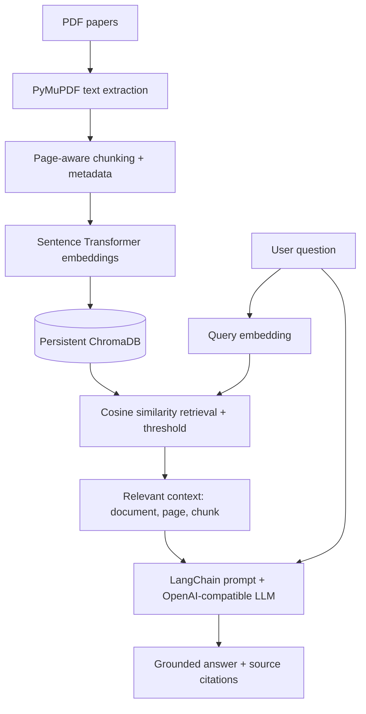

# Research Paper RAG

A local Retrieval-Augmented Generation (RAG) application for asking grounded questions across up to four AI research papers. It includes a FastAPI REST API, a Streamlit UI, persistent ChromaDB storage, Sentence Transformer embeddings, and OpenAI-compatible answer generation.

## Architecture



## RAG workflow

1. Upload PDF files (up to four) through the UI or `POST /upload`.
2. `POST /process` extracts each page with PyMuPDF, splits page text into overlapping chunks, embeds the chunks, and persists vectors and metadata in ChromaDB.
3. A query is embedded with the same Sentence Transformer. ChromaDB returns the nearest chunks; results below the configured similarity threshold are discarded.
4. LangChain formats the remaining document name, page number, and chunk text into a context-only prompt and calls the configured OpenAI-compatible chat model.
5. The response includes the answer and the exact retrieved source chunks with document, page, chunk ID, and cosine similarity. With no qualifying context the API returns the required not-available answer without calling the LLM.

## Technologies

- Python 3.11+
- FastAPI, Pydantic 2, Uvicorn
- Streamlit
- LangChain Core and LangChain OpenAI
- ChromaDB persistent client
- Sentence Transformers (`sentence-transformers/all-MiniLM-L6-v2`)
- PyMuPDF
- pytest and HTTPX

## Installation

From this directory:

```bash
python -m venv .venv
# Windows PowerShell
.venv\Scripts\Activate.ps1
# macOS/Linux: source .venv/bin/activate
python -m pip install --upgrade pip
pip install -r requirements.txt
Copy-Item .env.example .env  # Windows PowerShell
# macOS/Linux: cp .env.example .env
```

Set `OPENAI_API_KEY` in `.env` before querying. The key is not needed to start the API, upload/process papers, or run tests. For an OpenAI-compatible provider, set `OPENAI_BASE_URL` as well. The first embedding operation downloads the configured Sentence Transformer model if it is not already cached.

## Run locally

Start the REST API in one terminal:

```bash
uvicorn app.main:app --host 0.0.0.0 --port 8000
```

Start the UI in another terminal:

```bash
streamlit run frontend/streamlit_app.py
```

Open `http://localhost:8501`. API docs are at `http://localhost:8000/docs`. The UI uses `http://localhost:8000` by default; override it with `RAG_API_URL` if necessary.

`run.sh` runs both processes on macOS/Linux. On Windows, use the two terminal commands above.

## Docker

```bash
docker compose up --build
```

The UI is available at `http://localhost:8501`, and the API at `http://localhost:8000`. Set `OPENAI_API_KEY` in your host environment or `.env` before starting to enable answer generation. The `data` directory is mounted for local PDF and vector persistence.

## Configuration

Copy `.env.example` to `.env` and configure:

| Variable | Default | Description |
|---|---|---|
| `OPENAI_API_KEY` | empty | API key for answer generation |
| `OPENAI_BASE_URL` | empty | Optional compatible provider URL |
| `LLM_MODEL` | `gpt-4o-mini` | Chat completion model |
| `EMBEDDING_MODEL` | `sentence-transformers/all-MiniLM-L6-v2` | Local embedding model |
| `CHUNK_SIZE` | `1000` | Chunk length in characters |
| `CHUNK_OVERLAP` | `200` | Overlap in characters |
| `TOP_K` | `5` | Default maximum retrieved chunks |
| `SIMILARITY_THRESHOLD` | `0.3` | Minimum cosine similarity (range `-1` to `1`) |
| `CHROMA_PERSIST_DIRECTORY` | `./data/chroma` | Persistent vector database directory |
| `PAPERS_DIRECTORY` | `./data/papers` | Uploaded PDF directory |
| `MAX_UPLOAD_MB` | `50` | Maximum size of a single PDF |

## API

- `GET /health` — application health.
- `POST /upload` — multipart upload; accepts repeated `files` fields, up to four papers total.
- `POST /process` — validate, extract, chunk, embed, and persist newly uploaded papers.
- `GET /documents` — list processed documents and their page/chunk counts.
- `DELETE /documents` — clear the vector collection. Uploaded PDFs remain available for reprocessing.
- `POST /query` — ask a question, with optional `top_k`, `similarity_threshold`, and model override.

Example:

```bash
curl -X POST http://localhost:8000/query \
  -H "Content-Type: application/json" \
  -d "{\"question\":\"What is multi-head attention?\",\"top_k\":5}"
```

Example response:

```json
{
  "answer": "Multi-head attention runs multiple attention operations in parallel, allowing the model to attend to information from different representation subspaces [attention_is_all_you_need.pdf, page 4].",
  "sources": [
    {
      "document": "attention_is_all_you_need.pdf",
      "page": 4,
      "content": "Multi-head attention allows the model to jointly attend to information...",
      "score": 0.82,
      "chunk_id": "..."
    }
  ]
}
```

## Example questions

- What are the main components of a RAG model, and how do they interact?
- What are the two sub-layers in each Transformer encoder layer?
- Explain positional encoding in Transformers.
- Why is multi-head attention beneficial?
- What is few-shot learning and how does GPT-3 implement it?
- How do the approaches described in these papers differ?

## Tests

```bash
pytest
```

Tests mock the embedding model and LLM where appropriate; no API key or model download is needed. PDF extraction is tested with a generated in-memory PDF.

## Troubleshooting

- **Missing API key:** set `OPENAI_API_KEY` in `.env`. Ingestion works without it; queries with relevant sources return a clear configuration error.
- **No context found:** lower the similarity threshold or upload/process the relevant paper. The system will not call the LLM without a qualifying chunk.
- **Invalid or empty PDF:** upload only readable PDFs with extractable text; scanned image-only PDFs need OCR, which is not currently included.
- **Embedding model download errors:** ensure the machine can access Hugging Face on the first run, or pre-cache the selected Sentence Transformer model.
- **Different model provider:** set `OPENAI_BASE_URL`, `OPENAI_API_KEY`, and `LLM_MODEL` to the provider's compatible endpoint/key/model.
- **Chroma persistence errors:** ensure the configured data directory is writable and not being shared by incompatible application versions.

## Future improvements

OCR for scanned papers, hybrid BM25/vector retrieval, reranking, asynchronous ingestion, document deletion by ID, and support for additional metadata filters can be added behind the modular ingestion and retrieval interfaces.
