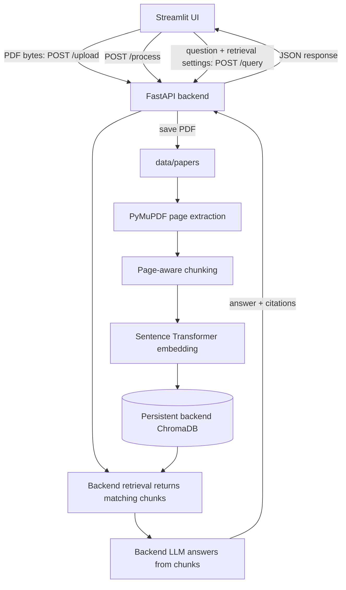

# Research Paper RAG

An end-to-end question-answering application for three or four AI research papers. The application has a strict service boundary: **the backend owns uploaded files, PDF processing, embeddings, ChromaDB, retrieval, and LLM answer generation; the Streamlit frontend is only an API client.**

## Project structure

```text
Project_RAG/
├── backend/
│   ├── app/
│   │   ├── api/              # FastAPI routes and Pydantic schemas
│   │   ├── embeddings/       # Sentence Transformer embeddings
│   │   ├── generation/       # Backend-only OpenAI-compatible RAG chain
│   │   ├── ingestion/        # PDF extraction, chunking, indexing
│   │   ├── retrieval/        # Backend-only persistent ChromaDB and retriever
│   │   ├── utils/
│   │   ├── config.py
│   │   └── main.py
│   ├── tests/
│   ├── Dockerfile
│   ├── requirements.txt      # Backend runtime dependencies only
│   └── requirements-dev.txt
├── frontend/
│   ├── streamlit_app.py      # UI and HTTP requests only
│   ├── Dockerfile
│   └── requirements.txt      # Streamlit and HTTP client only
├── data/
│   ├── papers/               # Backend upload destination (local/Docker volume)
│   └── chroma/               # Backend persistent vector database
├── .env.example
├── docker-compose.yml
├── requirements.txt          # Convenience install for local development/tests
└── run.sh
```

## Service responsibilities

### Backend (`backend/`)

- Accepts PDF bytes at `POST /upload`, validates them, and saves them under `data/papers/`.
- Extracts pages with PyMuPDF, chunks text with filename/page/chunk metadata, embeds on the backend, and writes vectors to persistent ChromaDB.
- Retrieves matching chunks, sends their text and page citations to the configured LLM, and returns the answer with its sources.
- Reads `OPENAI_API_KEY` and `LLM_MODEL` from the backend environment. The query API does not accept a caller-selected model.

### Frontend (`frontend/`)

- Displays upload, processing, retrieval, and question-answer controls.
- Sends PDF bytes and query options to FastAPI; displays the answer and returned sources.
- Does not import or install ChromaDB, Sentence Transformers, LangChain, or an LLM client. It never reads the OpenAI key or writes uploaded files.

## Request flow



## Run with Docker (recommended)

From the project root:

```powershell
Copy-Item .env.example .env  # only if .env does not already exist
notepad .env                 # set OPENAI_API_KEY for answer generation
docker compose up --build
```

Open the UI at `http://localhost:8501`; FastAPI and interactive API docs are at `http://localhost:8000` and `http://localhost:8000/docs`.

Compose builds separate images. Only the backend service receives `.env` and mounts `data/`. The Streamlit container receives only `RAG_API_URL=http://backend:8000` and waits for the backend health check. Neither image includes the other service's application dependencies.

Stop the services with `Ctrl+C`. Add `-d` to run detached, then use `docker compose down` to stop them. Uploaded PDFs and Chroma data are retained in the host `data/` directory.

## Run locally on Windows

Run commands from the project root. The UI talks to the local API at `http://localhost:8000`.

Create and activate a Python 3.11+ environment if needed:

```powershell
py -3.11 -m venv venv
.\venv\Scripts\Activate.ps1
```

If PowerShell blocks activation, allow scripts for this PowerShell process only:

```powershell
Set-ExecutionPolicy -Scope Process -ExecutionPolicy Bypass
.\venv\Scripts\Activate.ps1
```

Install the combined local-development dependencies:

```powershell
python -m pip install --upgrade pip
python -m pip install -r requirements.txt
if (-not (Test-Path .env)) { Copy-Item .env.example .env }
```

Activation is optional. Use `.\venv\Scripts\python.exe` instead of `python` for the following commands if shell environment injection or activation is disabled.

Start the backend in the first terminal:

```powershell
python -m uvicorn backend.app.main:app --host 0.0.0.0 --port 8000
```

Start the frontend in a second terminal:

```powershell
python -m streamlit run frontend/streamlit_app.py
```

Both commands must run from the project root so the backend reads the root `.env` and uses the root `data/` folder. The frontend itself needs no OpenAI credentials.

For Linux/macOS, create/activate a Python 3.11+ environment with the platform's normal `venv` commands, install `requirements.txt`, and run the same two `python -m ...` commands. `run.sh` launches both services for local development.

## Add research papers

Upload PDFs through the Streamlit sidebar at `http://localhost:8501`. The browser transfers file bytes to the backend `/upload` endpoint; the **backend** saves each accepted PDF to:

```text
Project_RAG/data/papers/
```

Click **Process Documents** after uploading. The backend extracts text, creates page-aware chunks and embeddings, then persists them in `data/chroma/`. The system supports up to four PDFs, with a 50 MB default limit per upload. Image-only/scanned PDFs need OCR and currently are reported as having no extractable text.

## Configuration

Copy `.env.example` to `.env` and configure the backend. Keep real credentials in `.env` only; `.env` is ignored by Git and excluded from Docker build context.

| Variable | Default | Description |
|---|---|---|
| `OPENAI_API_KEY` | empty | Backend key for answer generation |
| `OPENAI_BASE_URL` | empty | Optional OpenAI-compatible API base URL |
| `LLM_MODEL` | `gpt-4o-mini` | Backend-selected generation model |
| `EMBEDDING_MODEL` | `sentence-transformers/all-MiniLM-L6-v2` | Backend embedding model |
| `CHUNK_SIZE` | `1000` | Chunk length in characters |
| `CHUNK_OVERLAP` | `200` | Overlap in characters |
| `TOP_K` | `5` | Default number of candidates to retrieve |
| `SIMILARITY_THRESHOLD` | `0.3` | Minimum cosine similarity, from `-1` to `1` |
| `CHROMA_PERSIST_DIRECTORY` | `./data/chroma` | Backend ChromaDB directory |
| `PAPERS_DIRECTORY` | `./data/papers` | Backend PDF upload directory |
| `MAX_UPLOAD_MB` | `50` | Maximum size of an individual PDF |
| `RAG_API_URL` | `http://localhost:8000` | Frontend API URL; Compose sets it to `http://backend:8000` |

The first processing or querying operation downloads/loads the embedding model if it is not cached.

## Backend API

All of these endpoints run in FastAPI; the frontend does not perform the work itself.

| Method | Endpoint | Purpose |
|---|---|---|
| `GET` | `/health` | Backend health check |
| `POST` | `/upload` | Upload PDF multipart field(s) named `files` |
| `POST` | `/process` | Process newly uploaded PDFs and create/update backend vectors |
| `GET` | `/documents` | List indexed papers and page/chunk counts |
| `DELETE` | `/documents` | Clear ChromaDB collection; uploaded PDFs remain |
| `POST` | `/query` | Backend retrieval and answer generation |

Example query:

```powershell
curl.exe -X POST http://localhost:8000/query `
  -H "Content-Type: application/json" `
  -d "{\"question\":\"What is multi-head attention?\",\"top_k\":5}"
```

Example response:

```json
{
  "answer": "Multi-head attention allows the model to attend to information from different representation subspaces [attention_is_all_you_need.pdf, page 4].\n\nSources: [Source 1: attention_is_all_you_need.pdf, page 4]",
  "sources": [
    {
      "document": "attention_is_all_you_need.pdf",
      "page": 4,
      "content": "Multi-head attention allows the model to jointly attend to information...",
      "score": 0.82,
      "chunk_id": "..."
    }
  ]
}
```

`POST /query` accepts `question`, and optional `top_k` and `similarity_threshold`. It rejects extra fields; model selection and API credentials stay backend-only. When no context meets the threshold, the backend returns: `"The answer is not available in the provided documents."`

## Tests

Install development dependencies with root `requirements.txt`, then run from the project root:

```powershell
python -m pytest backend/tests -q
```

Tests use generated PDF fixtures and mock embeddings/vector results/LLM output. They do not require a live OpenAI key or downloading the embedding model.

## Troubleshooting

- **Cannot connect to API:** start the backend and verify `http://localhost:8000/health` returns `{"status":"ok"}`. In Compose, the frontend uses the internal host `backend`, not `localhost`.
- **`OPENAI_API_KEY` missing:** set it in the root `.env`; it is read by the backend only. Document processing does not require this key.
- **No answer/relevant sources:** confirm papers have been processed and lower the similarity threshold if appropriate.
- **PDF has no extractable text:** the current extractor needs embedded text; scanned papers require OCR.
- **Model download fails:** ensure the backend can access Hugging Face on first use or pre-cache the Sentence Transformer model.
- **Compose cannot find a file:** run `docker compose` from the project root, where `docker-compose.yml` resides.

## Possible extensions

OCR, hybrid BM25/vector search, reranking, background ingestion jobs, document-level deletion, authentication, and configurable metadata filters can be added behind the backend service without putting data or model logic in Streamlit.
